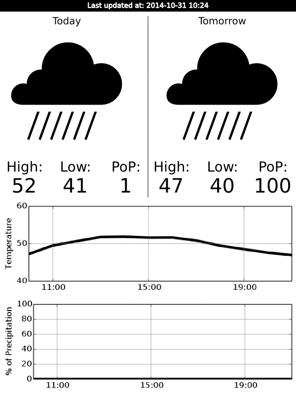
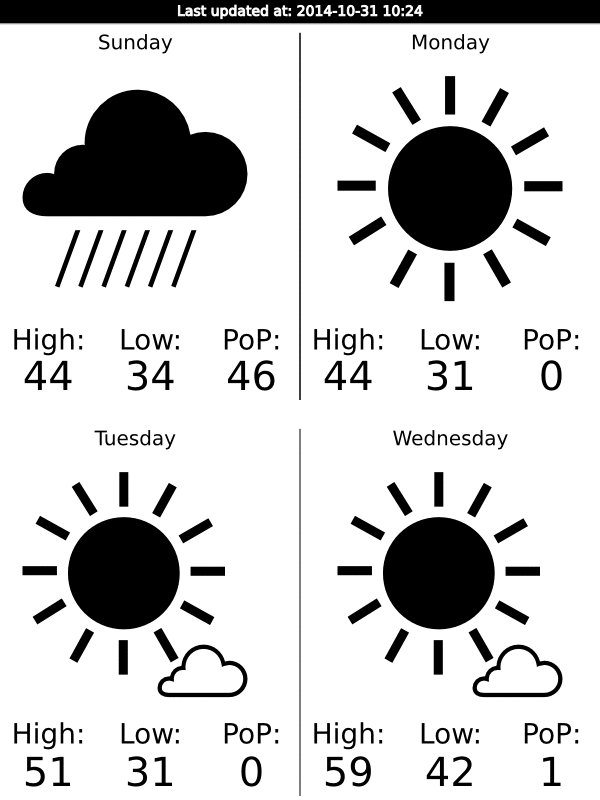

This is a set of scripts that allows you to use an Amazon [Kindle][]
as a weather display device.  This was inspired by [Matthew Petroff's
work][mpetroff], but I have rewritten just about everything for this
project.

[kindle]: http://amazon.com/kindle
[mpetroff]: http://mpetroff.net/2012/09/kindle-weather-display/

This will initially display summary forecasts for the current day and
the next day, as well as temperature and probability of precipitation
graphs for the next 12 hours:

If you press the main button on the Kindle, you will get summary
forecasts for the subsequent four days:

## On the server

The server component interacts with the remote weather API and
generates a set of PNG images.

You can install the server component like any other python package:

    python setup.py install

You will need to arrange for the `kindle-weather` program to run
periodically, possibly via cron.  On my system, I created
`/etc/cron.hourly/weather` with the following contents:

    #!/bin/sh

    cd /var/www/vhosts/weather/docs
    exec kindle-weather -f /etc/weather/weather.yaml \
      -o /var/www/vhosts/weather/docs/ -d \
      > /var/log/weather.log 2>&1

Where `/var/www/vhosts/weather/docs` is the `DocumentRoot` for an
Apache virtual host.

You will need to provide `kindle-weather` with a configuration file
(in [YAML][] format) with a top-level `weather` key containing at
least the following items:

[yaml]: http://en.wikipedia.org/wiki/YAML

- `apikey` -- your forecast.io API key
- `location` -- your location expressed as *latitude,longitude*
- `timezone` -- your local timezone

An example configuration might look like this:

    weather:
      apikey: 123456789
      location: 42.3581,-71.0636
      timezone: US/Eastern

Drop that into a file somewhere and point `kindle-weather` at it using
the `-f` command line option.

## On the Kindle

The kindle component is a collection of shell scripts.  You can copy
everything in the `kindle` directory to a directory on your Kindle.
If your Kindle is mounted as a USB storage device, you could:

    cp -r kindle /path/to/kindle/wather/

Or you can copy it via `scp` to your Kindle:

    scp -r kindle root@your.kindle.ip:/mnt/us/weather

You will need to arrange for the `init-weather.sh` script to run at
boot, and you will need configure your Kindle to periodically execute
the `fetch-and-display-weather.sh` script.

